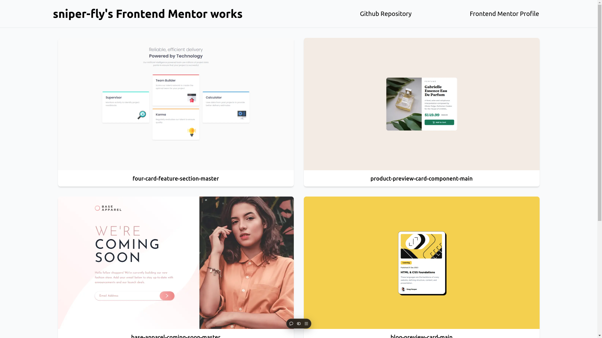

# Frontend Mentor Projects
[FrontendMentor](https://www.frontendmentor.io/) is a platform that helps developers improve their skills through project-based learning.
Here's sniper-fly's works.

## Link
- [My Frontend Mentor Profile](https://www.frontendmentor.io/profile/sniper-fly)
- [Live website top page](https://frontend-mentor-sniper-fly.vercel.app/)

## List of Projects

- https://github.com/sniper-fly/frontend_mentor/tree/master/src/app/four-card-feature-section-master
- https://github.com/sniper-fly/frontend_mentor/tree/master/src/app/product-preview-card-component-main
- https://github.com/sniper-fly/frontend_mentor/tree/master/src/app/recipe-page-main
- https://github.com/sniper-fly/frontend_mentor/tree/master/src/app/blog-preview-card-main
- https://github.com/sniper-fly/frontend_mentor/tree/master/src/app/base-apparel-coming-soon-master

## Tech stack
- HTML
  - semantic tags
- CSS
  - TailwindCSS
  - CSS Modules
  - Grid Layout
  - Animation
- TypeScript
- React
- Next.js
