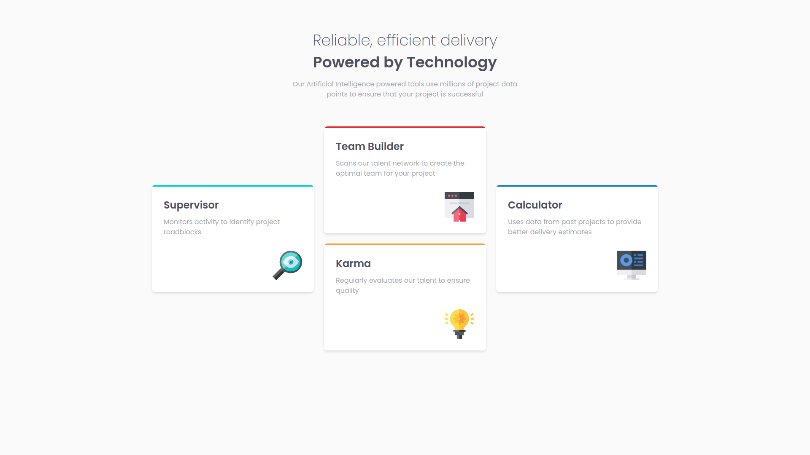

# Frontend Mentor - Four card feature section solution

This is a solution to the [Four card feature section challenge on Frontend Mentor](https://www.frontendmentor.io/challenges/four-card-feature-section-weK1eFYK). Frontend Mentor challenges help you improve your coding skills by building realistic projects. 

## Overview

# Frontend Mentor

This is a solution to the . Frontend Mentor challenges help you improve your coding skills by building realistic projects. 

## Overview

### The challenge

Users should be able to:

- View the optimal layout for the site depending on their device's screen size

### Screenshot

### Links

- Live Site URL: [Add live site URL here]()

### What I learned
#### What are you most proud of, and what would you do differently next time?
#### What challenges did you encounter, and how did you overcome them?
#### What specific areas of your project would you like help with?

### Built with

- Semantic HTML5 markup
- [tailwindcss](https://tailwindcss.com/) - CSS framework
- Flexbox
- [React](https://reactjs.org/) - JS library
- [Next.js](https://nextjs.org/) - React framework

## Author
- Frontend Mentor - [@sniper-fly](https://www.frontendmentor.io/profile/sniper-fly)
