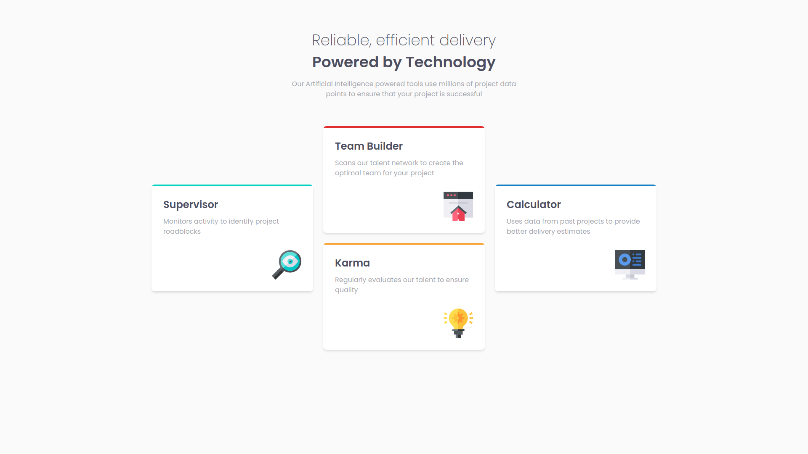

# Frontend Mentor - Four card feature section solution

This is a solution to the [Four card feature section challenge on Frontend Mentor](https://www.frontendmentor.io/challenges/four-card-feature-section-weK1eFYK). Frontend Mentor challenges help you improve your coding skills by building realistic projects. 

## Overview

# Frontend Mentor

This is a solution to the . Frontend Mentor challenges help you improve your coding skills by building realistic projects. 

## Overview

### The challenge

Users should be able to:

- View the optimal layout for the site depending on their device's screen size

### Screenshot

### Links

- Live Site URL: [https://frontend-mentor-three-ivory.vercel.app/four-card-feature-section-master](https://frontend-mentor-three-ivory.vercel.app/four-card-feature-section-master)

### What I learned
#### What are you most proud of, and what would you do differently next time?
コンポーネントの再利用性を高めるために様々な工夫をした。
- カードの中身の情報（タイトル、ロゴ、説明）を配列データとして持たせ、カードコンポーネントに柔軟に引数として渡せるようにした。
- grid-template-areaを使ってカードの親要素のみで画面幅の変更に対応した。
- overflow-hidden を利用した。

I made various efforts to enhance the reusability of components,
like:
- storing the card's content information (title, logo, description) as an array of data, allowing it to be flexibly passed as arguments to the card component.
- using grid-template-area to handle changes in screen width only with the parent element of the card.
- using round and overflow-hidden class to make cards round.

#### What challenges did you encounter, and how did you overcome them?
モバイル版の画面とデスクトップ版の画面でカードの配置を変える必要があったが、これはflexboxのみで実現するのは難しいため、gridを使うことにした。
grid-row, grid-columnを使うことで目標の配置を実現することは可能だが、
カードそれぞれに異なった条件分岐を記載する必要があるため、コンポーネントの再利用性も下がるし配列データをmap関数で繰り返し処理するのも難しい。
カード自体には配置を変えるためのクラスを付与せず、カードの親の要素が全て制御できるようにしたかったので、
grid-template-areasを使ってカードの親要素が画面の大きさの違いに際して生じる配置の制御を担うようにした。
grid-template-areasはtailwindCSSのクラスでは利用できないため、CSS moduleを使うことで解決した。

I needed to change the card layout between the mobile and desktop versions, but achieving this with "flex" was challenging, so I decided to use "grid".
While it’s possible to achieve the desired layout with grid-row and grid-column, it would require writing different conditional logic for each card, which would reduce the reusability of the component and make it difficult to process the array data using the map function.
I wanted the parent element of the cards to have full control over the layout without adding layout-specific classes to each card.
Therefore, I used grid-template-areas to allow the parent element to handle the layout adjustments based on screen size.
Since grid-template-areas isn't available as a utility in TailwindCSS, I resolved this by using CSS modules.

### Built with
- Semantic HTML5 markup
- [tailwindcss](https://tailwindcss.com/) - CSS framework
- Flexbox
- [React](https://reactjs.org/) - JS library
- [Next.js](https://nextjs.org/) - React framework
- [CSSModule](https://github.com/css-modules/css-modules) - CSS file called by js

## Author
- Frontend Mentor - [@sniper-fly](https://www.frontendmentor.io/profile/sniper-fly)
