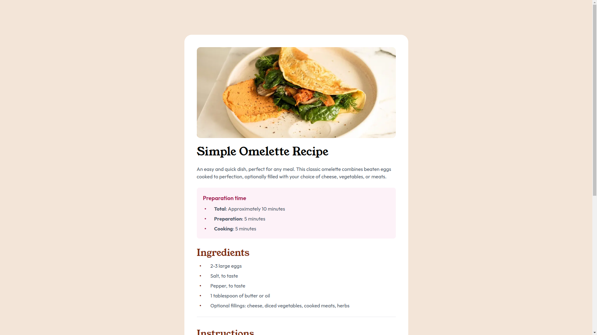

# Frontend Mentor - Recipe page solution

This is a solution to the [Recipe page challenge on Frontend Mentor](https://www.frontendmentor.io/challenges/recipe-page-KiTsR8QQKm). Frontend Mentor challenges help you improve your coding skills by building realistic projects. 

## Overview

### Screenshot

### Links

- Live Site URL: [https://frontend-mentor-three-ivory.vercel.app/recipe-page-main](https://frontend-mentor-three-ivory.vercel.app/recipe-page-main)

### What I learned
#### What are you most proud of, and what would you do differently next time?
- 実際のデザインの写真と文字の位置がほぼ一緒になるように調整した。
I tried to adjust the place where the actual character is and the design one.

The actual design was adjusted so that the position of the text was approximately the same as the actual design photo.

#### What challenges did you encounter, and how did you overcome them?
- 箇条書きの中点と文章の位置をしっかり離すために、各リストごとにflexを指定した。
Flexbox is specified in each lists to make the space between the text and bullet points.

A flex was specified for each listing to keep the midpoint of the bullet points and sentences well apart.

"Flexbox" is specified for each lists to make the space between the text and bullet points.

#### What specific areas of your project would you like help with?
- 箇条書きを表現するとき、中点と文章の位置を離すためのCSSが汚くなってしまった。
どのようにすればエレガントに書けたのか、他の人の例から学びたい。

The CSS classes to make the space between bullet points and text was not clean
because it has many repetitions. I want to learn more sophisticated and elegant
way to express this design through reading others' examples.

When expressing bullet points, the CSS for separating the midpoint from the text was messy.
I would like to learn from others' examples how it could have been written elegantly.

The CSS classes to make the space between bullet points and text was not clean
because it has many repetitions. I want to learn from others' examples how it could have been written elegantly.

### Built with

- Semantic HTML5 markup
- Flexbox
- CSS Grid
- [tailwindcss](https://tailwindcss.com/) - CSS framework
- [React](https://reactjs.org/) - JS library
- [Next.js](https://nextjs.org/) - React framework

## Author
- Frontend Mentor - [@sniper-fly](https://www.frontendmentor.io/profile/sniper-fly)
